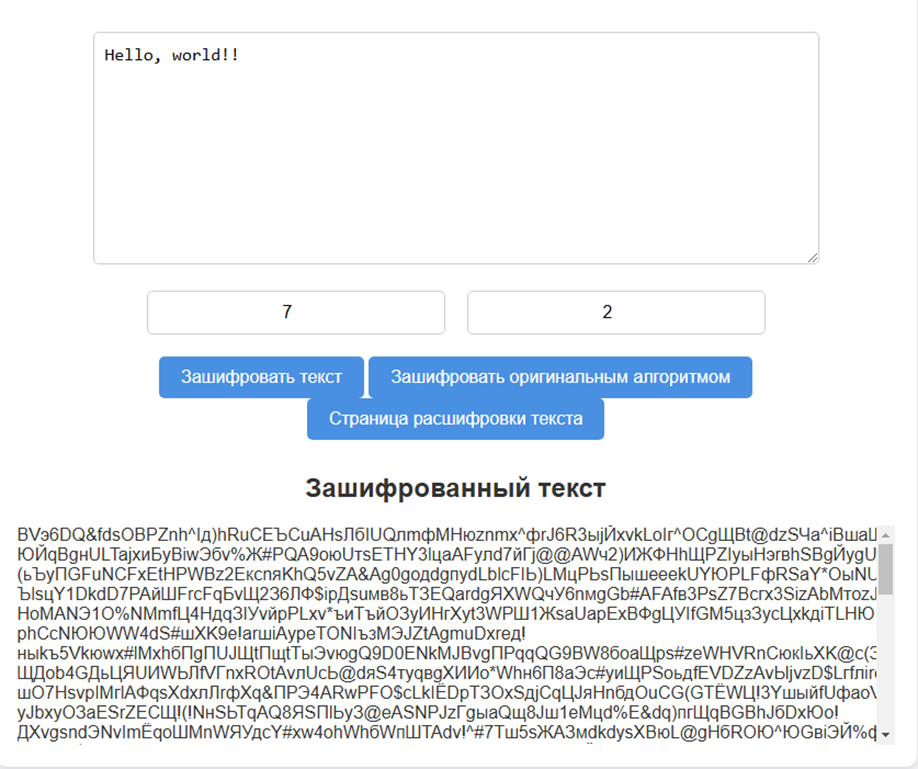
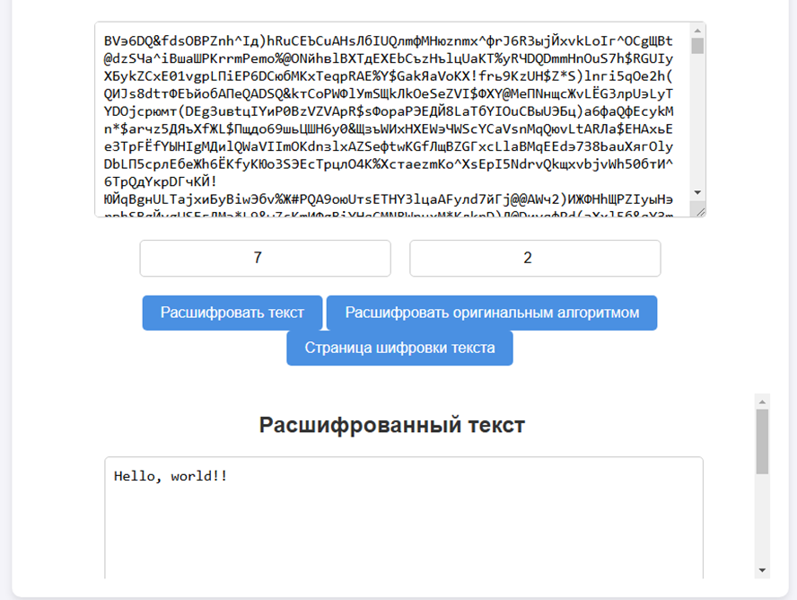

# Алгоритм (шифр) маршрутной перестановки

Преобразования из этого шифра состоят в
том, что в фигуру исходный текст вписывается по определённому направлению
(«маршруту»), а затем по ходу совершенно другого направления осуществляется
извлечение из неё.   
Для повышения криптостойкости алгоритма, он был модифицирован следующим образом.  
Матрица, в котором находятся все символы текста, была расширена, чтобы количество переборов увеличилось.  
В расширенной матрице помещается оригинальная матрица, а все пустые значения заменяются шумом.  
Размеры новой, расширенной матрицы определяются следующим образом:

`R_new = R^(sqrt(C)) * C^2`

`C_new = C^(sqrt(R)) * R^2`

R_new - Количество строк в расширенной матрице
C_new - Количество столбоц в расширенной матрице 
R - Количество строк в оригинальной матрице
C - Количество колонок в оригинальной матрице  

Для определения координат оригинальной матрицы в расширенной матрице, используется следующие формулы  

`R_start = (R!) % R_new`  
`C_start = (C!) % C_new`

Примеры использования  

Шифрование текста

Расшифровка текста
